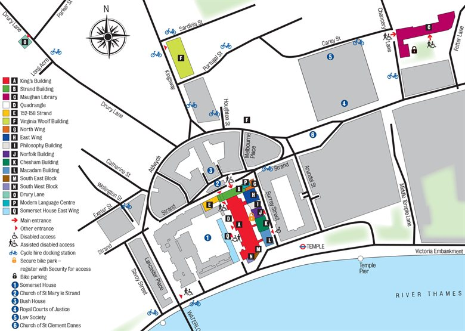

This event is hosted at the Strand Building of [King's College London](http://www.kcl.ac.uk/index.aspx).

The nearest underground stations are Temple and Covent Garden. Covent Garden should be avoided at peak times (8-9 in the morning and 6-7 in the evening).

There's a huge amount of accommodation available within a short distance

---
